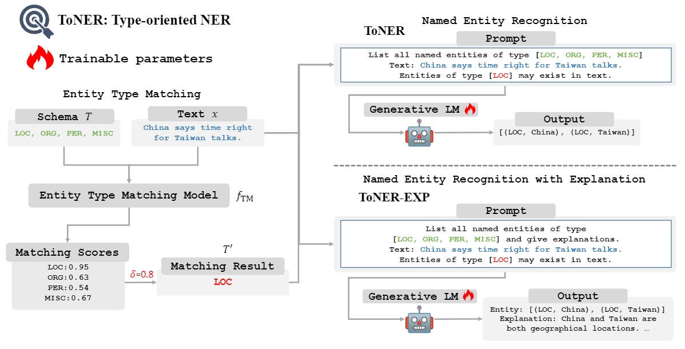

# ToNER


If you find our work useful for your research, please cite the following paper:
```
@inproceedings{jiang2024toner,
  title={ToNER: Type-oriented Named Entity Recognition with Generative Language Model},
  author={Jiang, Guochao and Luo, Ziqin and Shi, Yuchen and Wang, Dixuan and Liang, Jiaqing and Yang, Deqing},
  booktitle={Proceedings of the 2024 Joint International Conference on Computational Linguistics, Language Resources and Evaluation (LREC-COLING 2024)},
  pages={16251--16262},
  year={2024}
}
```

## Environment
Create a new Python virtual environment for ToNER:
```bash
conda create -n toner python=3.8
conda activate toner
pip install -r requirements.txt
```

## Data Preparation
Please save your dataset in `data` folder.

- CoNLL2003: [https://huggingface.co/datasets/conll2003](https://huggingface.co/datasets/conll2003)
- OntoNotes 5.0: [https://huggingface.co/datasets/tner/ontonotes5](https://huggingface.co/datasets/tner/ontonotes5)
- JNLPBA: [https://huggingface.co/datasets/jnlpba](https://huggingface.co/datasets/jnlpba)
- ACE2004: [https://catalog.ldc.upenn.edu/LDC2005T09](https://catalog.ldc.upenn.edu/LDC2005T09)
- ACE2005: [https://catalog.ldc.upenn.edu/LDC2006T06](https://catalog.ldc.upenn.edu/LDC2006T06)

## Train
### Type Matching Model
Please review `flat_recall_train.py` when you want to use ToNER in flat NER dataset or `nest_recall_train.py` when you want to use ToNER in nest NER dataset, and change some import parameters.
```bash
python flat_recall_train.py
python nest_recall_train.py
```

### Data Generation
Please review `data/flat_cls.py` for ToNER in flat NER dataset, `data/flat_exp.py` for ToNER-EXP in flat NER dataset, `data/nest_cls.py` for ToNER in nest NER dataset, `data/nest_exp.py` for ToNER-EXP in nest NER dataset, and change some import parameters.
```bash
python data/flat_cls.py
python data/flat_exp.py
python data/nest_cls.py
python data/nest_exp.py
```

### Train ToNER
Please review `main.py` and `config.yaml` for your ToNER training, and change some import parameters.
```bash
accelerate launch --config_file config.yaml --debug main.py
```

